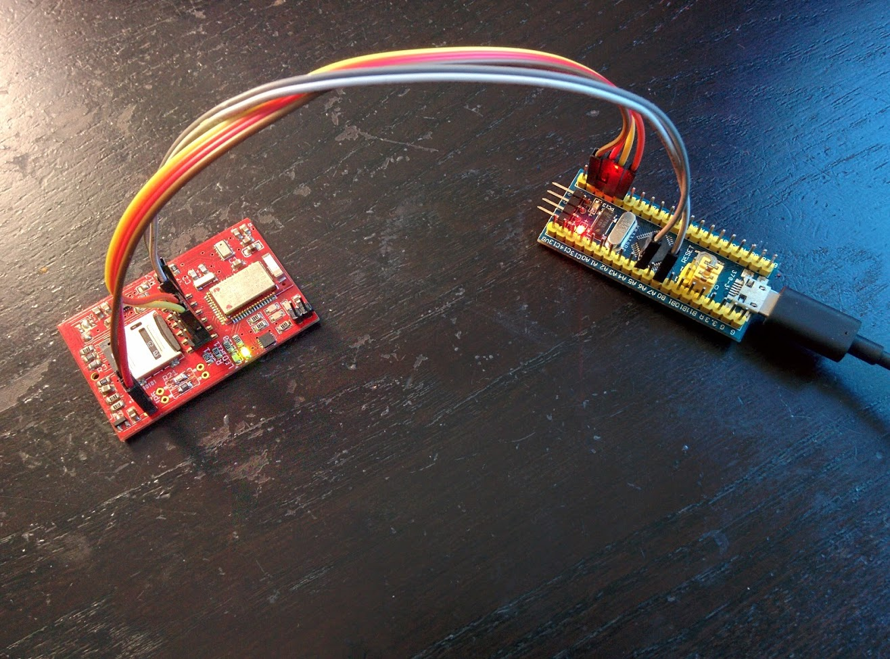

This is my fork of blackmagic probe adding SWAG

SWAG is an almost-realtime synchronous two wire printf transport.

Background
----------

Unless you're tolerant to extremly shitty vendor tools for debugging,
you probably had to work with mcus in a state where not even uart worked properly.
In such case, i usually fall back to toggling an led, until i get uart back working.
However, i found myself to do this more often than i'd expect, so i switched uart to bitbanged by default,
which is of course slow.

SWAG is basically SPI, which has zero overhead. All clock cycles are for stuff you actually want to print.
It requires 3 clock cycles per bit, which is about the minimum possible.

The only faster way to transport debug output to your host would rely on the MCUs peripherals working.


Blackmagicprobe integration
----------

Integrating SWAG into BMP allows flashing the target as well as debugging it from a single hardware, reducing
the amount of clutter on my table dramatically.




Setup
-----------

I use an stmf103 mini 'blue pill'. It's quite bad but cheap enough to buy 3 and hope 1 works.
You could use any stm32 that exposes SPI, i guess. Just needs to change platform.h

On the blue pill, here's the pinout:

F        | PIN
---------|---
SWD_IO   | B8
SWD_CLK  | B9
UART_TX  | A2
UART_RX  | A3
SWAG_CLK | A5
SWAG_IO  | A7


To flash the bluepill, you need another swd thing and do:

```
make -j4 PROBE_HOST=swaglink

openocd -f interface/stlink-v2.cfg -f target/stm32f1x_stlink.cfg \
    -c 'init' -c 'targets' -c 'halt' -c 'stm32f1x unlock 0' \
    -c "flash write_image erase blackmagic.bin 0x8002000" -c 'reset run' -c 'shutdown'
```


sometimes needs to be done twice, because BMP does some locking stuff and i can't be bothered to fix the above command to do it in the right order. maybe another reset or something.

Target
----------

here's some code for nrf51 for example

```
#define SWAG_DIO 0
#define SWAG_CLK 30

#define SWAG_DIO_HIGH   NRF_GPIO->OUTSET = (1 <<  SWAG_DIO)
#define SWAG_DIO_LOW    NRF_GPIO->OUTCLR = (1 <<  SWAG_DIO)
#define SWAG_CLK_HIGH   NRF_GPIO->OUTSET = (1 <<  SWAG_CLK)
#define SWAG_CLK_LOW    NRF_GPIO->OUTCLR = (1 <<  SWAG_CLK)

//waiting zero clock cycles is ok too. YMMV
#define SWI_CLOCK_DELAY __ASM ("NOP")

void swag_init()
{
    NRF_GPIO->DIRSET = (1 << SWAG_DIO | 1 << SWAG_CLK);

    //sync
    nrf_gpio_cfg_input(SWAG_DIO, NRF_GPIO_PIN_PULLUP);
    for (int i = 0; i < 16; i++) {
        nrf_delay_us(10);
        //dio low = we're synced
        if (nrf_gpio_pin_read(SWAG_DIO) == 0) {
            break;
        }
        SWAG_CLK_HIGH;
        nrf_delay_us(10);
        SWAG_CLK_LOW;
    }

    nrf_gpio_cfg_output(SWAG_DIO);
    nrf_delay_ms(20);
    printf("synced\r\n");
}

static void swag_transfer(uint8_t byte_out)
{
    for (uint8_t bit = 0x80; bit; bit >>= 1) {
        if (byte_out & bit) {
            SWAG_DIO_HIGH;
        } else {
            SWAG_DIO_LOW;
        }

        SWI_CLOCK_DELAY;
        SWAG_CLK_HIGH;
        SWI_CLOCK_DELAY;
        SWAG_CLK_LOW;
    }
}
int _write(int file, const char *p_char, int len)
{
    for (int i = 0; i < len; i++) {
        swag_transfer(p_char[i]);
    }
    return len;
}


```
